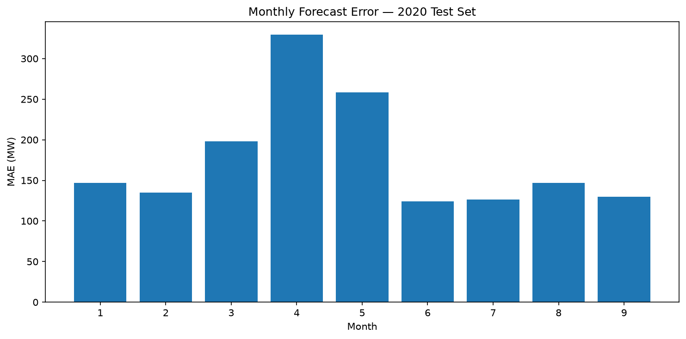
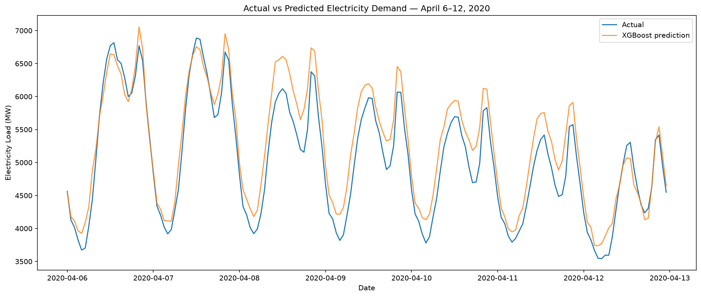

# WattAhead

> An end-to-end machine learning project for short-term electricity demand forecasting in Greece using historical load, calendar effects, and weather data.

**Final 2020 holdout performance:** **177.3 MW MAE · 3.43% MAPE · 42.2% lower MAE than previous-day persistence**

---

## Overview

Electricity demand follows strong temporal patterns, but it is also influenced by weather, weekends, holidays, and changes in human activity.

**WattAhead** explores whether these signals can be combined to accurately forecast hourly electricity demand in Greece.

The project covers the complete data science and machine learning workflow:

- data validation and cleaning
- missing-value analysis and imputation
- external weather-data integration
- exploratory data analysis
- temporal and cyclical feature engineering
- persistence baseline construction
- chronological train/validation/test splitting
- linear and nonlinear model comparison
- feature ablation
- XGBoost hyperparameter tuning
- final holdout evaluation
- temporal error and forecast-bias analysis
- model serialization and reusable inference

The prediction target is:

```text
load_mw — hourly electricity demand in MW
```

---

## Dataset

### Electricity demand

The original electricity-load dataset contains **50,401 hourly observations**, covering approximately:

```text
31 December 2014 → 30 September 2020
```

Initial inspection showed:

| Property | Value |
|---|---:|
| Observations | 50,401 |
| Mean load | ~5,820 MW |
| Median load | ~5,770 MW |
| Minimum load | ~3,010 MW |
| Maximum load | ~9,749 MW |
| Missing load observations | 38 |
| Missing percentage | ~0.07% |
| Duplicate timestamps | 0 |

**Electricity data source:** `[ADD DATASET SOURCE HERE]`

### Missing-value analysis

The missing observations were investigated before imputation rather than being immediately discarded.

Of the 38 missing load values:

- 1 occurred in 2014
- 1 occurred in 2015
- **35 occurred in 2016**
- 1 occurred in 2020

Several of the 2016 missing values formed contiguous gaps rather than isolated observations.

Missing values were reconstructed while preserving an explicit indicator:

```text
was_imputed
```

This allowed the hourly time series to remain continuous for subsequent lag construction while retaining information about which target observations were synthetic.

Importantly, **imputed target observations were excluded from model training and evaluation**.

---

## Weather Enrichment

Electricity consumption is affected by environmental conditions, particularly temperature.

Historical hourly weather data were retrieved from the **Open-Meteo Historical Weather API** for four major Greek population centres:

- Athens
- Thessaloniki
- Patras
- Larissa

For each city, the following variables were collected:

```text
temperature_2m
relative_humidity_2m
wind_speed_10m
```

All weather observations were retrieved in UTC and aligned with the electricity-load timestamps.

### Aggregate weather features

In addition to city-level variables, national proxy features were constructed:

```text
temperature_mean
temperature_min
temperature_max
humidity_mean
wind_speed_mean
```

These aggregate variables allow the model to capture broad weather conditions across different parts of Greece.

### Weather-data limitation

The project uses **historical observed weather**.

A real day-ahead forecasting system would instead need to use weather forecasts that were actually available at prediction time. Consequently, the weather component should be interpreted as an experimental evaluation of weather's predictive value rather than a complete production forecasting pipeline.

---

## Exploratory Data Analysis

EDA was performed before model development to understand the structure of electricity demand and guide feature engineering.

Several important patterns emerged.

### Temporal behaviour

Electricity demand exhibits strong:

- hourly seasonality
- daily cycles
- weekly patterns
- working-day vs non-working-day differences
- seasonal variation

These patterns motivated the creation of lag, calendar, holiday, and cyclical features.

### Temperature and electricity demand

Electricity consumption also showed a nonlinear relationship with temperature.

Demand tends to increase under temperature extremes, consistent with additional heating and cooling requirements.

This suggested two things:

1. weather information could provide predictive information beyond historical load;
2. nonlinear models might capture these relationships better than purely linear approaches.

---

## Feature Engineering

The final forecasting dataset contains several families of predictors.

### Historical demand

```text
lag_24
lag_48
lag_168
```

These correspond to electricity demand at the same hour:

- one day earlier
- two days earlier
- one week earlier

The lag features provide the model with information about recent daily and weekly demand patterns.

### Calendar features

Raw calendar variables:

```text
hour
day_of_week
month
```

Cyclical representations:

```text
hour_sin
hour_cos

dow_sin
dow_cos

month_sin
month_cos
```

Cyclical encoding represents the circular nature of time.

For example, hour `23` and hour `0` are temporally close even though their raw numerical values are far apart.

### Calendar flags

```text
is_weekend
is_holiday
is_non_working_day
```

`is_non_working_day` captures the broader behavioural distinction between normal working days and weekends/holidays.

### Weather features

The final model uses:

```text
temperature_mean
temperature_min
temperature_max
humidity_mean
wind_speed_mean
```

Together, the final XGBoost model receives **20 input features**.

---

## Evaluation Methodology

Because this is a time-series forecasting problem, observations were **not randomly shuffled** between training and testing.

Doing so could allow information from later periods to influence model development and would produce an unrealistic estimate of future forecasting performance.

### Model-development split

During model development:

```text
2015–2018  → Training
2019       → Validation
2020       → Untouched holdout
```

The 2019 validation period was used for:

- model comparison
- feature analysis
- feature ablation
- hyperparameter selection

The 2020 data were kept untouched during these decisions.

### Final training

After the model configuration was locked, the selected model was retrained using all available pre-2020 observations:

```text
2015–2019          → Final training
Jan–Sep 2020       → Final holdout test
```

The final test set contains **6,575 hourly observations**.

This provides a strictly forward-looking evaluation in which the model is trained exclusively on past data and evaluated on future observations.

---

## Forecasting Baselines

Machine-learning performance was compared against simple persistence forecasts.

Three baselines were evaluated on the 2019 validation period:

| Baseline | MAE (MW) | RMSE (MW) | MAPE |
|---|---:|---:|---:|
| Previous Day | 305.77 | 443.02 | 5.14% |
| Two Days Ago | 429.72 | 588.97 | 7.23% |
| Previous Week | 448.43 | 617.59 | 7.48% |

The **previous-day persistence forecast** was the strongest baseline and was therefore used as the main benchmark.

---

## Model Comparison

Three machine-learning approaches of increasing nonlinear complexity were evaluated.

### Ridge Regression

Ridge Regression was used as the first learned benchmark.

Because Ridge is sensitive to feature scale, its input features were standardized before training.

Validation performance:

| Model | MAE (MW) | RMSE (MW) | MAPE |
|---|---:|---:|---:|
| Previous Day | 305.77 | 443.02 | 5.14% |
| Ridge Regression | **247.78** | **336.05** | **4.20%** |

The improvement over persistence demonstrated that combining historical demand, calendar information, and weather provided useful predictive information.

### Random Forest

A Random Forest regressor was then introduced to capture nonlinear relationships and interactions between features.

Validation performance:

| Model | MAE (MW) | RMSE (MW) | MAPE |
|---|---:|---:|---:|
| Ridge Regression | 247.78 | 336.05 | 4.20% |
| Random Forest | **153.03** | **217.33** | **2.57%** |

The large improvement over Ridge indicated that important relationships in electricity demand were nonlinear.

### XGBoost

Finally, gradient-boosted trees were evaluated using XGBoost.

Validation performance:

| Model | MAE (MW) | RMSE (MW) | MAPE |
|---|---:|---:|---:|
| Previous Day | 305.77 | 443.02 | 5.14% |
| Ridge Regression | 247.78 | 336.05 | 4.20% |
| Random Forest | 153.03 | 217.33 | 2.57% |
| **XGBoost** | **135.05** | **183.01** | **2.29%** |

XGBoost produced the strongest validation performance and was selected for further analysis.

---

## Feature Importance

XGBoost's built-in feature importance showed that recent historical demand was the strongest source of predictive information.

The leading features included:

| Feature | Importance |
|---|---:|
| `lag_24` | 57.1% |
| `is_non_working_day` | 14.4% |
| `lag_168` | 7.8% |
| `is_holiday` | 3.8% |
| `day_of_week` | 3.5% |
| `lag_48` | 2.5% |
| `hour_cos` | 1.6% |
| `temperature_mean` | 1.4% |

Demand from the previous day is therefore the single strongest predictor, while weekly history, calendar behaviour, holidays, time of day, and weather provide additional information.

Feature importance should **not** be interpreted as causal contribution. Several predictors are correlated, meaning importance can be distributed between related variables.

For this reason, a separate feature-ablation experiment was performed.

---

## Feature Ablation Study

To measure the contribution of different feature families more directly, the same XGBoost configuration was trained repeatedly while changing only the available predictors.

Four configurations were evaluated:

1. historical lags only
2. lags + weather
3. lags + calendar
4. all features

### Results

| Feature Set | MAE (MW) | RMSE (MW) | MAPE |
|---|---:|---:|---:|
| Lags only | 273.79 | 393.40 | 4.61% |
| Lags + Weather | 246.11 | 343.35 | 4.18% |
| Lags + Calendar | 174.85 | 255.95 | 2.89% |
| **All Features** | **134.60** | **182.05** | **2.28%** |

### Interpretation

Historical demand alone provides a strong forecasting signal, but additional context substantially improves performance.

Adding weather to historical demand reduced MAE from:

```text
273.79 MW → 246.11 MW
```

Calendar information produced an even larger improvement:

```text
273.79 MW → 174.85 MW
```

The strongest result was obtained when **historical demand, calendar information, and weather were combined**:

```text
134.60 MW MAE
2.28% MAPE
```

This experiment also demonstrates why built-in feature importance alone can be misleading.

Although individual weather variables received relatively modest importance scores, removing weather from the complete feature set caused a substantial loss in predictive performance.

---

## XGBoost Hyperparameter Tuning

A small controlled hyperparameter search was performed using **only the 2019 validation period**.

The search explored variations in:

```text
max_depth
min_child_weight
learning_rate
```

The best validation MAE was obtained with:

```text
max_depth = 6
min_child_weight = 1
learning_rate = 0.03
```

However, the difference between `min_child_weight=1` and `min_child_weight=3` was negligible:

```text
min_child_weight = 1 → MAE 135.009 MW
min_child_weight = 3 → MAE 135.053 MW
```

The second configuration also produced a slightly lower RMSE and provides marginally stronger regularization.

The final locked configuration was therefore:

```python
XGBRegressor(
    n_estimators=1000,
    learning_rate=0.03,
    max_depth=6,
    min_child_weight=3,
    subsample=0.8,
    colsample_bytree=0.8,
    objective="reg:squarederror",
    random_state=42,
    n_jobs=-1,
)
```

No hyperparameters were modified after evaluating the 2020 holdout.

---

# Final Holdout Performance

After model selection was complete, XGBoost was retrained using all available pre-2020 observations.

The final model was then evaluated on the previously untouched January–September 2020 period.

| Model | MAE (MW) | RMSE (MW) | MAPE |
|---|---:|---:|---:|
| Previous-Day Persistence | 306.57 | 429.83 | 5.43% |
| **WattAhead XGBoost** | **177.33** | **235.93** | **3.43%** |

### 42.16% lower MAE than previous-day persistence

The final model reduced mean absolute error from:

```text
306.57 MW → 177.33 MW
```

on unseen future observations.

RMSE was also reduced from approximately:

```text
429.83 MW → 235.93 MW
```

The final holdout performance is intentionally reported across the **entire test period**, including periods in which forecasting performance deteriorated substantially.

---

# Error Analysis: A 2020 Regime Shift

The final 2020 performance was noticeably worse than the approximately **135 MW MAE / 2.29% MAPE** obtained during 2019 validation.

Rather than treating this simply as poorer generalization, forecast error was analysed month by month.

## Monthly performance

| Month | MAE (MW) | MAPE |
|---|---:|---:|
| January | 146.96 | 2.24% |
| February | 134.68 | 2.24% |
| March | 198.13 | 3.72% |
| **April** | **329.21** | **7.43%** |
| **May** | **258.36** | **5.88%** |
| June | 124.41 | 2.45% |
| July | 126.65 | 2.02% |
| August | 146.89 | 2.48% |
| September | 129.59 | 2.40% |



Performance deteriorates sharply during March, peaks in April, remains elevated in May, and returns close to previous levels from June onwards.

---

## Forecast Bias

To determine whether the increase represented random forecasting noise or systematic error, monthly forecast bias was calculated as:

```text
bias = prediction - actual demand
```

Positive values therefore represent **overprediction**.

Selected results:

| Month | Mean Bias |
|---|---:|
| January | -51 MW |
| February | +12 MW |
| March | +83 MW |
| **April** | **+305 MW** |
| **May** | **+244 MW** |
| June | +82 MW |

In April, MAE reached approximately **329 MW**, while mean bias reached **+305 MW**.

The deterioration was therefore largely directional: the model was systematically expecting more electricity demand than actually occurred.

---

## March–May vs Remaining Test Period

The holdout was separated into the March–May period and the remaining test observations.

| Period | MAE (MW) | RMSE (MW) | MAPE |
|---|---:|---:|---:|
| March–May 2020 | 261.20 | 319.78 | 5.66% |
| Other test months | **134.95** | **179.21** | **2.30%** |

Outside March–May, performance was remarkably close to the original 2019 validation result:

```text
2019 validation MAE        ≈ 135 MW
Other 2020 months MAE      ≈ 135 MW
```

The degradation was therefore highly concentrated in a specific temporal period.

### Possible distribution shift

The timing coincides with the first COVID-19 restrictions and major changes in economic and social activity in Greece.

Because WattAhead was trained exclusively on **pre-2020 consumption behaviour**, the abrupt increase in error and systematic overprediction are consistent with a real-world distribution or regime shift.

This temporal association does **not** by itself establish COVID-19 restrictions as the sole causal mechanism. However, the concentration and direction of forecast errors provide evidence that the model encountered electricity-demand behaviour substantially different from its training distribution.

---

## Actual vs Predicted Demand

The effect can also be observed directly in the hourly forecasts.



During this representative April week, WattAhead continues to capture much of the underlying daily demand pattern.

However, predictions frequently remain above observed electricity demand, particularly around daytime peaks.

This visually corresponds to the strong positive forecast bias observed during April.

---

# Final Model Packaging

The selected XGBoost model is serialized independently from the training script:

```text
models/
├── wattahead_xgboost.json
└── wattahead_xgboost_metadata.json
```

The model is stored using XGBoost's native JSON serialization format.

The accompanying metadata contains:

- model type
- target variable
- exact feature order
- training period
- test period
- locked hyperparameters
- final test metrics
- persistence baseline metrics
- MAE improvement over the baseline

This allows the trained model to be loaded independently without repeating model development or training.

---

## Inference

`src/models/predict.py` demonstrates independent inference using the serialized model.

The script:

1. loads model metadata;
2. retrieves the expected feature order;
3. loads the serialized XGBoost model;
4. prepares an observation;
5. generates an electricity-demand prediction.

Example:

```text
Actual load:
4062.00 MW

Predicted load:
4171.44 MW
```

This verifies the complete:

```text
trained model
    ↓
serialization
    ↓
model reload
    ↓
feature reconstruction
    ↓
inference
```

workflow.

The current inference script assumes that the required lag, calendar, and weather features have already been generated. A production forecasting service would need to construct these automatically from historical load data, calendar information, and weather forecasts.

---

# Project Structure

```text
wattahead/
├── data/
│   ├── raw/
│   └── processed/
│
├── models/
│   ├── wattahead_xgboost.json
│   └── wattahead_xgboost_metadata.json
│
├── notebooks/
│
├── reports/
│   ├── figures/
│   │   ├── monthly_test_mae.png
│   │   ├── actual_vs_predicted_april_2020.png
│   │   └── actual_vs_predicted_april_week.png
│   │
│   └── results/
│       └── final_test_predictions.csv
│
├── src/
│   ├── data/
│   │   └── weather_data.py
│   │
│   ├── features/
│   │   └── build_features.py
│   │
│   └── models/
│       ├── evaluate_baselines.py
│       ├── train_ridge.py
│       ├── train_random_forest.py
│       ├── train_xgboost.py
│       ├── feature_ablation.py
│       ├── tune_xgboost.py
│       ├── final_model.py
│       └── predict.py
│
├── requirements.txt
└── README.md
```

---

# Reproducing the Project

## 1. Clone the repository

```bash
git clone [REPOSITORY URL]
cd wattahead
```

## 2. Create a virtual environment

```bash
python3 -m venv venv
source venv/bin/activate
```

## 3. Install dependencies

```bash
pip install -r requirements.txt
```

## 4. Retrieve and process weather data

```bash
python3 src/data/weather_data.py
```

## 5. Build forecasting features

```bash
python3 src/features/build_features.py
```

## 6. Train and evaluate the final model

```bash
python3 src/models/final_model.py
```

## 7. Test serialized-model inference

```bash
python3 src/models/predict.py
```

---

# Experimental Scripts

Individual modelling experiments can also be reproduced independently.

### Persistence baselines

```bash
python3 src/models/evaluate_baselines.py
```

### Ridge Regression

```bash
python3 src/models/train_ridge.py
```

### Random Forest

```bash
python3 src/models/train_random_forest.py
```

### XGBoost

```bash
python3 src/models/train_xgboost.py
```

### Feature ablation

```bash
python3 src/models/feature_ablation.py
```

### Hyperparameter tuning

```bash
python3 src/models/tune_xgboost.py
```

---

# Limitations

WattAhead is an experimental forecasting project rather than a production electricity-demand forecasting system.

Several limitations should be considered.

### Historical rather than forecast weather

The experiments use observed historical weather.

A true day-ahead system must use weather forecasts available at prediction time, which introduce their own uncertainty.

### Aggregate national target

The target represents aggregate electricity demand rather than regional demand.

Regional models could capture local weather and consumption patterns more precisely.

### Limited external variables

Demand is modelled primarily using:

- historical electricity consumption
- calendar information
- weather

Other factors such as economic activity, electricity prices, major events, industrial activity, or behavioural indicators could provide additional predictive information.

### Structural breaks

The March–May 2020 experiment demonstrates that models trained on historical behaviour can degrade significantly when consumption patterns change abruptly.

A production system would therefore require model monitoring and potentially regular retraining or drift detection.

### Point forecasts only

The current model produces point estimates.

Operational energy forecasting would benefit from prediction intervals or probabilistic forecasts that quantify uncertainty.

### Feature-dependent inference

The current inference pipeline expects engineered lag and weather features to already exist.

A production API would need to retrieve and construct these features automatically before inference.

---

# Future Work

Potential extensions include:

- true day-ahead inference using weather forecasts;
- walk-forward validation;
- rolling or scheduled model retraining;
- automated data-drift detection;
- probabilistic forecasting and prediction intervals;
- regional electricity-demand modelling;
- SHAP-based model interpretation;
- additional economic and behavioural variables;
- comparison with LightGBM and CatBoost;
- specialized time-series forecasting architectures;
- a FastAPI prediction service;
- automated forecasting and monitoring pipelines.

---

# Tech Stack

- **Python**
- **pandas**
- **NumPy**
- **scikit-learn**
- **XGBoost**
- **Matplotlib**
- **Open-Meteo API**

---

## Key Takeaways

WattAhead demonstrates several practical lessons from real-world forecasting:

1. **Strong baselines matter.**  
   A forecasting model should outperform simple persistence before its complexity is justified.

2. **Time-series validation must respect chronology.**  
   Model development used past observations to predict genuinely future periods rather than randomly shuffling the dataset.

3. **Feature engineering materially improved performance.**  
   Calendar and weather information provided substantial predictive value beyond historical demand alone.

4. **Nonlinear models were substantially more effective.**  
   Random Forest and XGBoost considerably outperformed Ridge Regression.

5. **Feature importance is not enough.**  
   Ablation experiments showed that weather provided meaningful predictive value despite relatively modest individual importance scores.

6. **Holdout performance tells a richer story than a single metric.**  
   The final model achieved **3.43% MAPE** overall, but temporal analysis revealed a concentrated period of substantially higher error.

7. **Distribution shifts matter.**  
   The March–May 2020 period demonstrated how an otherwise stable forecasting model can systematically fail when real-world behaviour changes.

---

## Final Result

> **177.33 MW MAE · 235.93 MW RMSE · 3.43% MAPE on the unseen 2020 holdout period**

> **42.16% reduction in MAE compared with previous-day persistence**

WattAhead combines historical electricity demand, calendar behaviour, and weather information to produce accurate hourly demand forecasts while demonstrating the importance of temporal validation, feature analysis, and robustness to real-world distribution shifts.